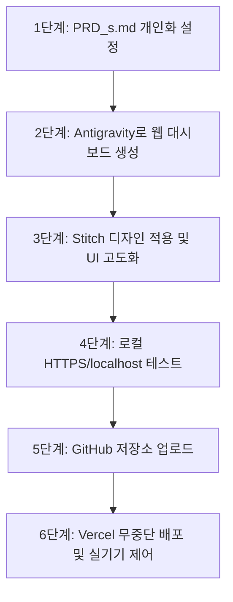

# 🌐 [학생용 가이드] PRD_s.md를 활용한 나만의 스마트홈 웹 대시보드 제작 및 배포 가이드

이 가이드는 **PRD_s.md** 파일의 사양을 바탕으로, 여러분만의 멋진 스마트홈 웹 제어기(대시보드)를 제작하고, 디자인을 꾸미며, 인터넷에 배포(Vercel)하여 실제 스마트폰으로 ESP32 기기를 제어하는 전체 과정을 친절하게 안내합니다.

> [!NOTE]
> ESP32 마이크로파이썬 펌웨어 코드(`smartHome.py`)는 사전에 이미 제공되므로, 여기서는 **웹 대시보드(`index.html`)의 제작 및 연동**에 집중합니다.

---

## 🗺️ 전체 개발 프로세스 한눈에 보기



---

## 1단계: 📝 PRD_s.md 파일 나에게 맞게 수정하기

가장 먼저 할 일은 대시보드와 ESP32 통신의 설계도가 되는 `PRD_s.md` 파일의 정보를 나만의 정보로 바꾸는 것입니다.

1. `PRD_s.md` 파일을 열고 **`## 📌 0. 프로젝트 기본 정보`** 섹션을 찾습니다.
2. 아래 대괄호(`[...]`) 안의 기본 내용을 **자신의 정보**로 직접 채워 넣습니다.

### ✍️ 수정 예시
```markdown
## 📌 0. 프로젝트 기본 정보 (학생이 채워주세요)

| 항목                     | 내용                                         |
| :----------------------- | :------------------------------------------- |
| **프로젝트명**     | `민준의 미래형 스마트홈` (또는 원하는 이름)   |
| **제작자**         | `김민준` (본인 이름)                         |
| **BLE 기기명**     | `ESP_minsu` (ESP_로 시작해야 검색이 쉽습니다) |
| **OLED 이미지**    | `img/pikachu.pbm` (OLED에 띄울 비트맵 이미지) |
| **메인 컬러 테마** | `Forest Green` (기본 / 그린 / 앰버 / 커스텀)  |
```

> [!WARNING]
> **블루투스 기기명 규칙**: 웹 브라우저에서 스캔할 때 혼선을 줄이기 위해 기기 이름은 반드시 **`ESP_`**로 시작하도록 적어주세요. (예: `ESP_student01`, `ESP_minsu` 등)

---

## 2단계: 🤖 Antigravity에 요청하여 웹 대시보드 코드 생성하기

수정한 `PRD_s.md`를 바탕으로 인공지능 코딩 파트너인 **Antigravity**에게 웹 대시보드의 뼈대를 만들어달라고 요청합니다. **(마이크로파이썬 펌웨어는 제공된 기본 코드를 그대로 사용하므로 패스합니다.)**

1. Antigravity 채팅창에 수정한 `PRD_s.md` 파일을 드래그하여 첨부하거나 `@PRD_s.md` 형태로 언급합니다.
2. 아래와 같이 명확하게 명령을 내립니다.

> **💬 Antigravity 요청 프롬프트 예시:**
> *"첨부한 PRD_s.md 파일을 기반으로 나만의 스마트홈 웹 대시보드를 만들고 싶어. 프로젝트명은 '민준의 미래형 스마트홈'이고, 기기명은 'ESP_minsu', 메인 컬러는 'Forest Green' 테마로 하고 싶어. 마이크로파이썬 코드는 따로 있으니, 웹 대시보드를 구성할 `index.html` 코드만 완벽하게 작성해줘."*

3. Antigravity가 만들어준 웹 대시보드 파일(`index.html`) 코드를 본인의 로컬 폴더에 저장합니다.

---

## 3단계: 🎨 Stitch(스티치)에서 고급 디자인 요소 디자인 및 적용하기

웹 대시보드의 기능을 다 갖추었다면, 이제 사용자가 보기에 감탄이 나오는 세련된 모습(네오모피즘, 글래스모피즘 등)으로 디자인을 완성해 봅니다.

1. **Stitch(스티치) 실행 및 템플릿 선택**:
   - Stitch 디자인 도구를 사용하여 대시보드에 어울리는 현대적이고 반응형 레이아웃을 생성합니다. (네오모피즘 버튼, 슬라이더, 센서 디스플레이 카드 등)
2. **이중 광원 그림자(Neumorphism CSS) 복사**:
   - 스티치에서 제공하는 네오모피즘 스타일의 그림자 속성을 확인합니다.
   ```css
   /* 평상시 튀어나온 입체적인 카드/버튼 스타일 */
   .card-raised {
     background: #f1f5f9;
     border-radius: 20px;
     box-shadow: 6px 6px 12px #cbd5e1, -6px -6px 12px #ffffff;
     transition: all 0.2s ease;
   }
   
   /* 마우스를 올리거나 터치할 때 살짝 눌리는 애니메이션 효과 */
   .card-raised:hover {
     transform: translateY(-2px);
     box-shadow: 8px 8px 16px #cbd5e1, -8px -8px 16px #ffffff;
   }

   /* 눌린 버튼(Sunken) 스타일 */
   .btn-pressed {
     box-shadow: inset 4px 4px 8px #cbd5e1, inset -4px -4px 8px #ffffff;
   }
   ```
3. **HTML/CSS 합치기**:
   - Stitch에서 디자인한 버튼, 배경 스타일, 네비게이션 탭 바 등의 CSS 클래스를 복사하여 여러분의 `index.html` 파일의 `<style>` 태그 내부에 붙여넣습니다.
   - HTML 구조도 스티치 레이아웃에 맞게 수정하여 심미성 높은 모바일 앱 형태(`max-width: 480px`)로 완성합니다.

---

## 4단계: 💻 로컬 웹 서버 실행 및 연결 테스트 (Web Bluetooth)

블루투스(Web Bluetooth API) 기술은 보안상의 이유로 **반드시 HTTPS 암호화 연결 또는 localhost(로컬 서버)에서만 작동**합니다. 단순히 마우스 더블클릭으로 HTML 파일을 열면 작동하지 않으므로, 아래 방식대로 로컬 서버를 실행해야 합니다.

### 1. 로컬 웹 서버 구동 (Python 이용)
1. 명령 프롬프트(CMD) 또는 터미널을 실행합니다.
2. 프로젝트가 있는 폴더 경로로 이동한 뒤, 아래 명령어를 실행합니다.
   ```bash
   python -m http.server 8000
   ```
3. 웹 브라우저(Chrome 또는 Edge)를 열고 다음 주소로 접속합니다.
   - 🌐 **접속 주소**: `http://localhost:8000`

### 2. 하드웨어 연결 및 기능 테스트
1. 이미 제공받은 `smartHome.py` 코드를 ESP32 기기에 업로드하고 실행시킵니다.
2. 웹사이트의 **[기기 연결]** 버튼을 클릭합니다.
3. 블루투스 기기 검색 팝업창에서 본인이 설정한 기기 이름(예: `ESP_minsu`)이 뜨는지 확인하고 선택하여 연결합니다.
4. **명령 테스트**:
   - 온습도/조도 새로고침 버튼을 눌러 센서 데이터가 통신 로그 터미널에 정상적으로 출력되는지 확인합니다.
   - LED 켜기/끄기, 부저 멜로디 재생 버튼을 누를 때 실제 하드웨어가 올바르게 작동하는지 테스트합니다.

---

## 5단계: 🐙 GitHub(깃허브)에 내 코드 올리기 (연결하기)

로컬에서 테스트가 완료된 완벽한 코드를 인터넷에 올리기 위해 깃허브 저장소를 생성하고 연동합니다.

1. **GitHub 로그인 및 새 저장소 생성**:
   - [GitHub 홈페이지](https://github.com)에 로그인한 뒤 우측 상단의 **[New repository]** 버튼을 누릅니다.
   - Repository name에 프로젝트 이름(예: `my-smart-home`)을 입력하고 **[Create repository]**를 클릭합니다.
2. **로컬 폴더에서 Git 초기화 및 커밋**:
   - 프로젝트 폴더 터미널에서 아래 명령어들을 차례대로 한 줄씩 실행합니다. (생략 없이 복사해서 사용하세요)
   ```bash
   # 1. git 초기화
   git init
   
   # 2. 업로드할 파일들 스테이징 영역에 추가 (점 '.'은 모든 파일을 뜻함)
   git add .
   
   # 3. 첫 번째 릴리즈 버전 커밋 메시지 작성
   git commit -m "feat: 스마트홈 대시보드 첫 빌드 완료"
   
   # 4. 메인 브랜치명을 main으로 설정
   git branch -M main
   
   # 5. 내 로컬 저장소와 방금 만든 원격 GitHub 저장소 연결
   # (아래 주소의 [GitHub-계정명] 부분을 실제 본인 아이디로 변경하세요)
   git remote add origin https://github.com/[GitHub-계정명]/my-smart-home.git
   
   # 6. 원격 저장소의 main 브랜치로 코드 업로드
   git push -u origin main
   ```
3. 업로드가 완료되면 깃허브 페이지를 새로고침하여 파일들이 정상적으로 올라갔는지 확인합니다.

---

## 6단계: ⚡ Vercel(버셀)로 배포하여 스마트폰에서 실기기 제어하기

이제 전 세계 누구나 접속할 수 있도록 나의 스마트홈 웹 대시보드를 Vercel 서비스를 활용해 무료 배포해 보겠습니다. Vercel은 보안 연결(HTTPS)을 기본 제공하므로 모바일 기기에서도 완벽하게 블루투스 작동이 가능합니다.

1. **Vercel 가입 및 GitHub 연동**:
   - [Vercel 공식 사이체](https://vercel.com)로 이동하여 **[Sign Up]**을 누르고 **[Continue with GitHub]**를 선택하여 가입 및 연동합니다.
2. **프로젝트 가져오기 (Import)**:
   - 로그인 후 대시보드에서 **[Add New...]** ➡️ **[Project]**를 클릭합니다.
   - 방금 전 올려둔 GitHub 저장소(`my-smart-home`) 우측의 **[Import]** 버튼을 클릭합니다.
3. **배포 설정 및 배포 완료**:
   - 빌드 설정(Framework Preset 등)은 기본값인 `Other`로 두고 아래의 **[Deploy]** 버튼을 누릅니다.
   - 약 10~30초 후 배포가 완료되면 불꽃놀이 효과와 함께 나만의 고유한 HTTPS 웹 주소가 발급됩니다. (예: `https://my-smart-home.vercel.app`)

### 📱 모바일 폰에서 무선 스마트홈 테스트하는 꿀팁!

* **🤖 안드로이드(Android) 사용자**:
  - 발급받은 Vercel 웹사이트 주소를 스마트폰 **크롬(Chrome) 브라우저**에 입력하여 접속한 뒤, 기기를 연결하여 방 안의 하드웨어를 제어합니다.
* **🍏 아이폰/아이패드(iOS) 사용자**:
  - Safari는 블루투스 통신을 지원하지 않습니다. 
  - **App Store에서 무료 앱인 [Bluefy - Web BLE Browser]**를 설치합니다.
  - Bluefy 앱을 실행하고 주소창에 내 Vercel 사이트 주소를 입력하여 접속하면 블루투스 스마트홈이 완벽하게 작동합니다.

---

### 🎉 축하합니다! 
여러분은 이제 직접 작성한 기획서(PRD_s.md)로 웹사이트를 디자인하고, 개발하여, 클라우드(Vercel) 배포까지 완료한 멋진 웹/IoT 개발자가 되었습니다. 완성된 대시보드를 가족과 친구들에게 자랑해보세요!
